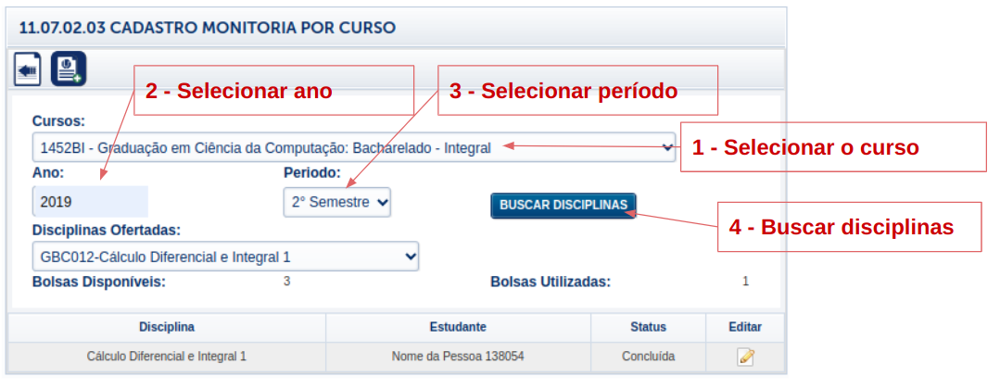

Módulo Coordenações
====================

Esta etapa deve ser executada pelas coordenações de curso, podendo também ser executadas pela DIREN, na tela 11.07.02.03 CADASTRO MONITORIA POR CURSO do SG.

Ao selecionar o curso, ano e período, o usuário poderá clicar em "BUSCAR DISCIPLINAS". 
O componente de disciplinas ofertadas será preenchido, ao selecionar uma disciplina o sistema irá buscar as disciplinas cadastradas para a disciplina-ano-período. Para editar a disciplina, o usuário poderá clicar no ícone que está na coluna editar da disciplina.

.. figure:: _static/images/cadastro_monitoria_curso.gif